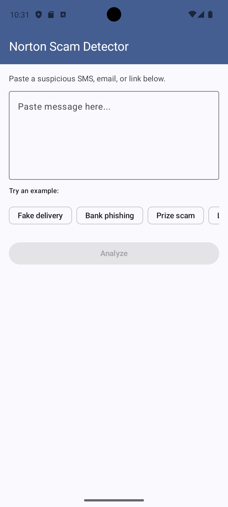
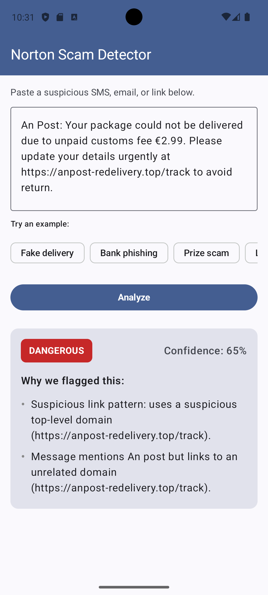
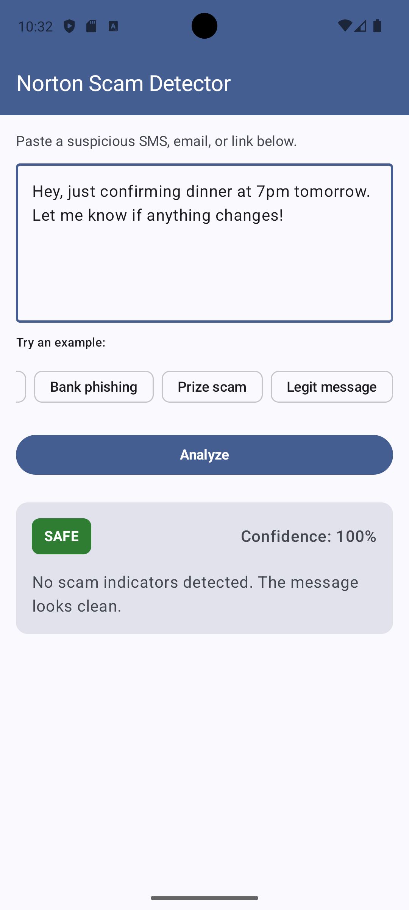

# Norton Scam Detector

Android prototype I built for the Gen Digital / Norton Mobile Engineering
**AI-First Intern** take-home. You paste a suspicious SMS, email, or URL
and the app tells you whether it looks like a scam, how confident it is,
and why.

I picked **Option B (Scam Message Detector)** because it lets the
analysis logic be a real piece of engineering with proper unit tests,
not just a UI exercise.

---

## TL;DR

- **Stack:** Kotlin, Jetpack Compose, MVVM, JUnit 4, coroutines-test.
- **Min SDK:** 26 (Android 8.0).
- **Architecture:** three layers (`data`, `domain`, `ui`). Pluggable
  detection rules behind a `DetectionRule` interface, aggregated by a
  `HeuristicAnalyzer` that itself sits behind a `ScamAnalyzer` interface
  so a future LLM-backed analyzer can swap in without UI changes.
- **Tests:** 37 unit tests across 4 test classes, including regression
  tests that pin two real bugs caught by AI code review.
- **AI workflow:** Claude was used throughout — architecture, rules,
  tests, and a full adversarial code review. See `ai-log.md` for six
  documented prompts with my reasoning on what I kept and what I changed.

---

## What it does

The screen has one big text field, a few example chips, and an Analyze
button.

When you tap Analyze, the app runs your text through five detection
rules, each looking for one specific scam indicator:

- **URL shorteners** (bit.ly, tinyurl, etc.) — scammers love them
  because they hide the real destination.
- **Urgency language** ("verify now", "account locked", "act
  immediately") — count-weighted, because one urgency phrase can be
  innocent but three together rarely are.
- **Suspicious domains** — free TLDs (.tk, .top, .xyz), raw IP
  addresses, hosts with too many hyphens.
- **Brand impersonation** — message mentions a well-known brand
  (Amazon, PayPal, AIB, An Post...) but links to a domain that brand
  doesn't actually own.
- **Excessive caps** — the "WINNER!!! CLAIM YOUR PRIZE NOW" pattern.

Each rule that fires contributes a weighted signal. The signals are
summed; the total maps to SAFE, SUSPICIOUS, or DANGEROUS. Confidence
scales with how far the total is from the nearest threshold — a clean
SAFE result is ~95% confident, a borderline SUSPICIOUS result honestly
reports something like 60%.

---

## Architecture

```
data/
  model/
    RiskLevel        ← enum SAFE/SUSPICIOUS/DANGEROUS
    DetectionSignal  ← one rule firing: name, weight 1-10, explanation
    AnalysisResult   ← verdict + confidence + signal list + timestamp
  samples/
    SampleMessages   ← curated examples for the UI chips

domain/
  analyzer/
    ScamAnalyzer       ← interface: suspend fun analyze(text) → AnalysisResult
    HeuristicAnalyzer  ← runs all rules, aggregates signals, derives risk
    rules/
      DetectionRule           ← interface: evaluate(text) → DetectionSignal?
      UrlShortenerRule
      UrgencyKeywordsRule
      SuspiciousDomainRule
      BrandImpersonationRule
      ExcessiveCapsRule

ui/
  screen/   DetectorScreen
  component/ RiskBadge, ResultCard
  viewmodel/ DetectorViewModel, DetectorUiState
  theme/    (Android Studio defaults)
```

### Why this shape

**Two interfaces, not one.** `DetectionRule` lets me add a new rule by
adding a single file — no aggregation code changes. `ScamAnalyzer` lets
me swap the whole analysis strategy (heuristic → LLM → hybrid) without
touching the UI or ViewModel. The KDoc on `ScamAnalyzer` spells this
out: `analyze` is already `suspend`, so a network-backed implementation
slots in without any signature changes.

**Rules return `DetectionSignal?` instead of always returning a signal.**
Returning null for "did not fire" keeps the result's signal list to
actual evidence — the UI only ever shows reasons that matter, never a
"rule X did not fire" entry. The AI code review specifically called this
out as a strong design choice.

**Confidence reflects ambiguity, not raw weight.** Earlier versions
returned 1.0 for any SAFE result, which silently contradicted the
KDoc claim that a SAFE result could be "probably safe, but not
certain". After AI code review I rewrote the math to scale by distance
from the threshold boundary. There are regression tests pinning this.

---

## Bugs caught by AI code review

I asked Claude (fresh chat, no context) to review the project as
a senior Android engineer at Norton would, and to be tougher than the
real reviewers. It returned 20 findings. Five were real bugs that
landed fixes before submission, with regression tests:

| # | Bug | File | Fix | Regression test |
|---|---|---|---|---|
| 1 | `String.contains` for legitimate-domain matching, so `amazon.com.evil-phish.tk` passed as legit Amazon | BrandImpersonationRule | Host extraction + `endsWith(".$legit")` suffix check | `does not match brand domain as a suffix` |
| 2 | `String.contains` for TLD matching, so `clickbank.com` was flagged because of `.click` | SuspiciousDomainRule | Host extraction + `endsWith(tld)` | `does not fire on TLD substring inside a host` |
| 3 | Substring brand matching, so `ups` fired on `groups` and `aib` on `caribbean` | BrandImpersonationRule | `\b$brand\b` word-boundary regex | `does not fire on substring brand match in unrelated word` |
| 4 | `confidenceFor` returned 1.0 for any SAFE result regardless of how close to threshold | HeuristicAnalyzer | Distance-from-boundary scoring | `confidence is lower for safe result near suspicious threshold` |
| 5 | `analyze` did regex work on whatever dispatcher the caller used (usually Main) | HeuristicAnalyzer | `withContext(Dispatchers.Default)`, dispatcher injected for tests | covered by existing tests using `UnconfinedTestDispatcher` |

The first three are exactly the class of bug a scam detector exists to
catch — easy to miss because the rules "look right" at a glance, but a
careful reader finds them. Catching them via AI review before submission
was the single highest-value moment in the project.

Full review transcript: `docs/ai-code-review.md`. My triage and
reasoning (what I accepted, modified, deferred, and rejected): `ai-log.md`
→ Prompts 4 and 5.

---

## AI workflow

Six documented prompts, full text in `ai-log.md`:

1. **Architectural foundation** — set the three-layer split and
   interface seams before any code was written.
2. **Rule design and weight calibration** — brainstormed indicators,
   ranked them by precision/recall, calibrated weights.
3. **Unit test generation** — drafted `UrlShortenerRuleTest`, then I
   added the cases the AI missed (notably the legitimate-URL false-
   positive guard).
4. **Adversarial code review** — the 20-point review above.
5. **Targeted fixes** — went back to Claude with specific fix plans
   for each kept review item and asked it to push back or confirm.
6. **README structure** — meta question on how to order this document.

What I want to highlight from those prompts:

- I disagreed with the AI on three review items and explained why in
  `ai-log.md`. Splitting `HeuristicAnalyzer` into three classes (review
  item #9) would have made the code harder to read at this scale.
  Moving `colorHex` out of `RiskLevel` (item #7) would have duplicated
  a `when` block across two UI files. Introducing a
  `ViewModelProvider.Factory` (item #8) is the right long-term answer
  but would not have changed any observable behaviour in this scope.
- I rewrote the AI's first-draft urgency rule because it used a fixed
  weight regardless of how many urgency phrases fired. The count-
  weighted version reflects the real signal better.
- I rejected the AI's suggestion of `Float` weights in favour of `Int`
  1..10 — easier to reason about, easier to test, no meaningful loss
  of precision for human-calibrated heuristics.

---

## Tests

37 unit tests across 4 test classes. All run in under a second.

```
UrlShortenerRuleTest        7 tests   happy path, false positives, case
HeuristicAnalyzerTest      13 tests   threshold boundaries, confidence
                                      curve, signal aggregation, clock
                                      injection, dispatcher injection
BrandImpersonationRuleTest  9 tests   5 happy/negative + 4 regression
SuspiciousDomainRuleTest    8 tests   patterns, IP URL, hyphens, +1
                                      regression for the .click bug
```

Each test class explains in its KDoc which cases were AI-drafted and
which I added manually. The regression tests are marked with a comment
naming the bug they pin.

I deliberately favoured **false-positive tests** over happy-path tests.
For a scam detector, flagging a legitimate message is worse than
missing a scam — false alarms train users to ignore real warnings.
The negative-case ratio in the test suite reflects that.

To run all tests:

```bash
./gradlew test
```

---

## How to build and run

```bash
git clone https://github.com/bohdankukuruza/norton-aifirst-intern-bohdankukuruza.git
cd norton-aifirst-intern-bohdankukuruza
```

Open the project in Android Studio (Hedgehog or newer). Let Gradle
sync. Run on an emulator (Pixel 7, API 34 used during development) or
a physical device.

Min SDK 26, target SDK 34. No API keys, no network calls, no special
setup — the analyzer is fully local.

---

## Screenshots

## Screenshots

| Empty state | Scam detected | Legitimate message |
|---|---|---|
|  |  |  |

---

## Demo video

**Video:** https://youtu.be/FylQ5aP4sqk

The video covers:

- App demo (~2 min): each chip, manual input, the three risk levels.
- Code walkthrough (~1.5 min): `DetectionRule` interface, how a new
  rule plugs in, the analyzer's aggregation logic.
- AI workflow (~1.5 min): real Claude conversation, one example of
  refining a prompt, the code review transcript.

---

## What I'd do next

Items from the AI code review I deliberately deferred. None of them
change observable behaviour today, but all of them are real:

- **Real DI** — `ViewModelProvider.Factory` wiring the analyzer in
  `MainActivity` instead of the current default-arg-on-the-constructor
  pattern. Makes the "swappable analyzer" claim genuine.
- **Generation tokens for stale-result race** — right now the input
  is disabled during analysis, but if a network-backed analyzer ever
  replaces the heuristic one, a slow response could land after the
  user has edited the input. Solution is a request-generation counter
  in the ViewModel.
- **Move presentation concerns out of `RiskLevel`** — the `colorHex`
  field is a leaky abstraction; the colour mapping belongs in
  `ui/component`. The current shape works because the prototype has
  one theme; a dark-mode pass would force the fix.
- **Extract `RiskClassifier` and `ConfidenceScorer`** — once the
  threshold values become tunable rather than fixed constants. At
  the current scale a single class is more readable.
- **Rename `data/model/` → `domain/model/`** — these are domain
  entities, not data-layer DTOs. Mechanical change, touches every
  import.
- **String resources** — every UI string is currently hardcoded. Any
  reviewer at a company that ships globally will flag this. Trivial
  to fix, deferred only to keep diffs small.
- **Accessibility** — `contentDescription` on the badge, semantics
  for the result card, haptic feedback on a DANGEROUS verdict.
- **Render `analyzedAt`** — the field is captured but never shown.
  Either render "analyzed Ns ago" or drop the field.
- **One-pass uppercase ratio in `ExcessiveCapsRule`** — current
  implementation allocates a temporary string for `filter { it.isLetter() }`.
  Cheap fix, low impact.
- **Property-based / parameterised tests** — JUnit5
  `@ParameterizedTest` over a CSV of inputs would give denser coverage
  for the rules. Worth doing once the rule set grows past a dozen.

---

## Reflection

The biggest lesson from this project was how much harder it is to
**use** AI well than to **use** AI at all. Asking Claude to generate
a class is easy and the output is usually fine. Asking Claude to
review your own work, accepting some findings and rejecting others
with reasons, and writing regression tests for the bugs it caught —
that's where the AI workflow stopped being a shortcut and started
being engineering.

Two specific moments stuck with me:

The brand-impersonation `String.contains` bug. I wrote that rule
myself, I reviewed it before committing, and it looked fine.
`url.contains("amazon.com")` reads like the obvious thing to do. The
review caught it in seconds. I'd never have shipped a code review
finding that sharp on my own, and the test I wrote in response (the
`amazon.com.evil-phish.tk` regression case) is the single best test
in the suite — it pins a real attacker pattern.

Disagreeing with the AI on the `RiskLevel.colorHex` review item. The
review was technically correct about leaky abstractions, but at the
prototype scale the alternative was worse. Saying "no, here's why"
felt more like real engineering than accepting every suggestion would
have.

The biggest thing I'd do differently is start the AI code review
**earlier**. I did it at the end, when "fix or defer" was the only
option. If I'd done it at the halfway point, I'd have had time to
implement two or three of the deferred items.